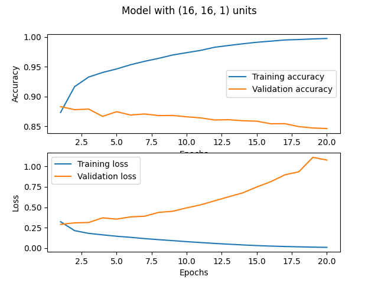
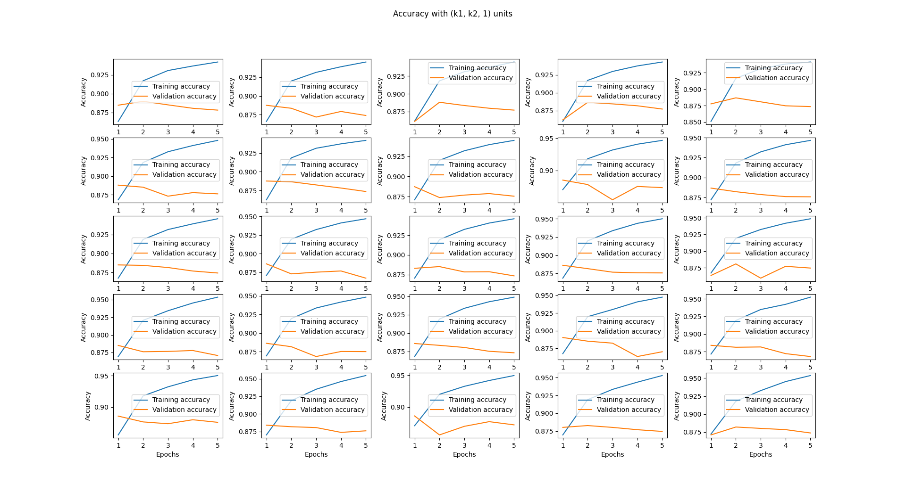
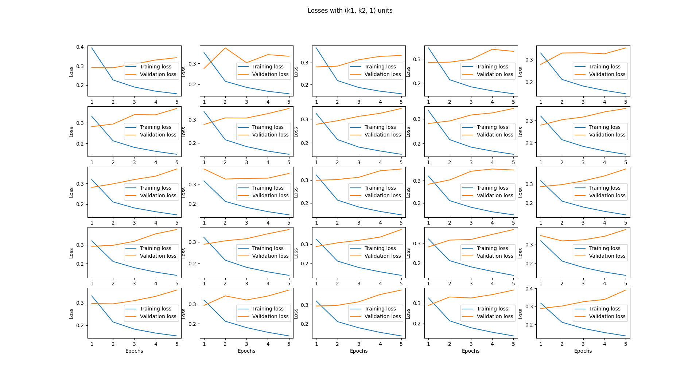

# Exercise 1
### Group 2

---

# The main model

Three layers
- Input layer: 16 units
- Hidden layer: 16 units
- Output layer: 1 unit with sigmoid activation function (binary classification)

```python
model = keras.Sequential()
model.add(Dense(16, activation='relu', input_shape=(NUM_WORDS,)))
model.add(Dense(16, activation='relu'))
model.add(Dense(1, activation='sigmoid'))
```

---

# Compiling and fitting

```python
model.compile(optimizer='rmsprop',
              loss='binary_crossentropy',
              metrics=['accuracy'])
```

```python
history = model.fit(train_data, train_labels,
                    epochs=20,
                    validation_data=(test_data, test_labels))
```

---

## Results



---

## Results

With 1 epoch, accuracy is ~88% (validation)

* For testing data, loss gets lower while accuracy goes higher
* For validation data, loss grows steadily and accuracy tends to go down

Probably overfitting

---

# Changing the units

We tried changing the units of the model in the range from $5$ to $25$ with steps of $5$

That is:
* Try the model (5, 5, 1)
* Try the model (5, 10, 1)
* ...
* Try the model (25, 25, 1)

---

```python
for i in range(5):
    for j in range(5):
        k1 = (i + 1) * 5
        k2 = (j + 1) * 5

        print(f'==> Checking model with ({k1}, {k2}, 1)')
        m = build_model(k1, k2)
        compile(m)
        h = fit_model(m)

        print('ACCURACY (testing, validation)')
        print(h.history['accuracy'])
        print(h.history['val_accuracy'])
        print('LOSS (testing, validation)')
        print(h.history['loss'])
        print(h.history['val_loss'])
```

---



---



---

# Changing the units
## Results

The graphs are not so different from the original one

Changing the units doesn't seem to affect much the results

---

# Code

Code and `.h5` file available at https://github.com/micheleberetta98/sdu-deep-learning-2021/tree/master/day-2